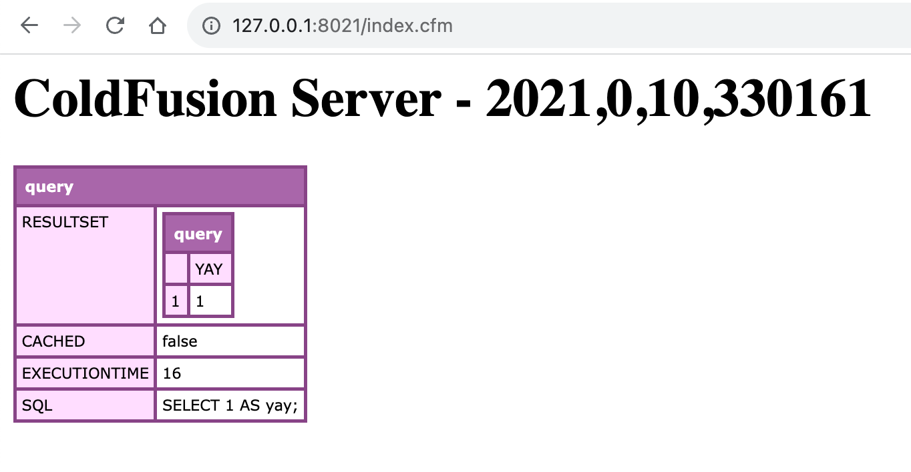
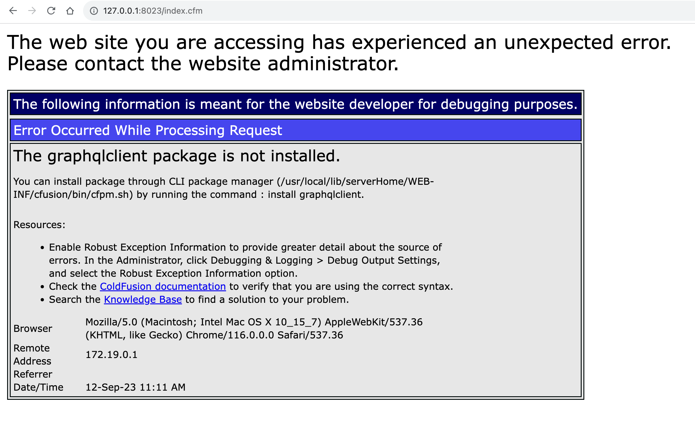
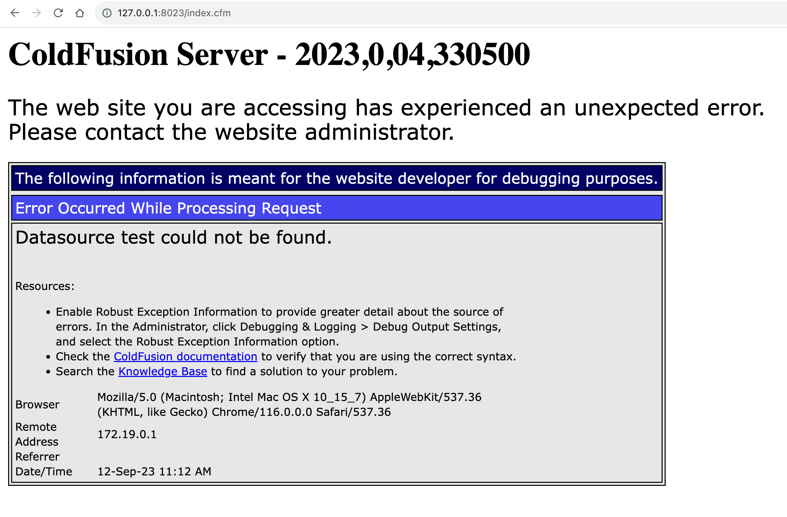

# ColdFusion Per-Application Datasource Test

This is a demo / reproduction repository to showcase that per-application datasources were working in ColdFusion 2021 but do _not_ seem to work with ColdFusion 2023 (at least not with the same code).

I'm going to use Docker with the OrtusSolutions images since these seem to be the only ones that will run on Apple M1 silicon. Each app has its own copy of the ColdFusion code since the server-startup scripts will collide if we try to mount the same volume for each app.

* **ColdFusion 2021** - http://127.0.0.1:8021/index.cfm
* **ColdFusion 2023** - http://127.0.0.1:8023/index.cfm

----

Each app uses the following per-application configuration code:

```cfc
component {

	this.datasources = {
		"test": {
			username: "root",
			password: "password",
			driver: "MySQL",
			class: "com.mysql.cj.jdbc.Driver",
			url: "jdbc:mysql://mysql:3306/demo"
		}
	};
	this.datasource = "test";

}
```

## Adobe ColdFusion 2021

When the application starts-up and you hit the `index.cfm`, you see the expected output:



## Adobe ColdFusion 2023

When the application starts-up and you hit the `index.cfm`, you see _two different errors_. First, you see an error about the GraphQL client not being installed:



Refreshing the page removes the GraphQL error but then shows the datasource error:



Neither of these errors is expected.
